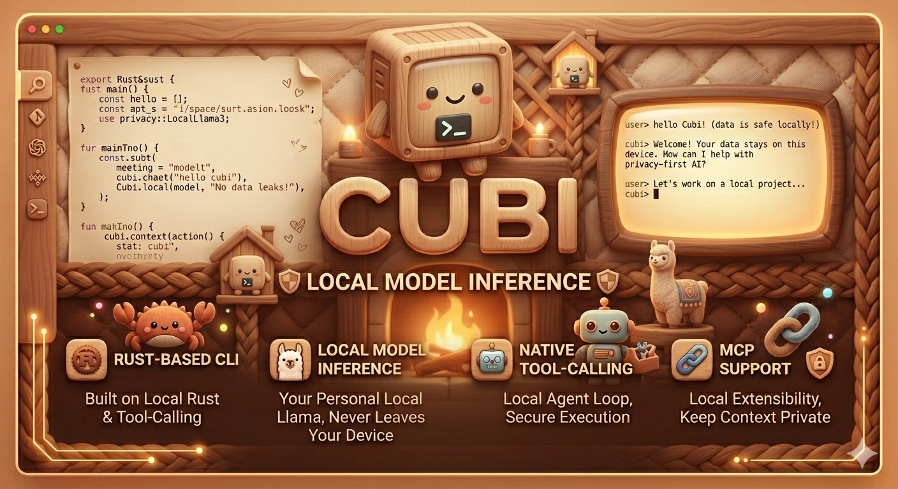

<p align="center">
  
</p>

# Cubi

A pocket-sized AI for your shell. Cubi is a Rust-based command-line AI chat
application with local model inference through Ollama (or any OpenAI-compatible
local server), a streaming native-tool-calling agent loop, and MCP support.

> **What's new:** interactive `cubi` now launches a full-screen terminal UI by
> default — markdown, syntax-highlighted code, colored diffs, framed tool calls,
> an animated thinking indicator, a scrollbar, `/theme` support, a slash-command
> picker, and command output rendered inside the transcript. The mouse wheel
> scrolls the transcript; keyboard `Up`/`Down` recall input history. Pass
> `--classic` (or set `CUBI_CLASSIC=1`) for the classic line-based REPL. See
> the "Interactive UI (TUI)" section below.

<div align="center">


</div>

## ✨ Features

- 🖥️ **Full-screen interactive UI** — interactive `cubi` opens a TUI by default
  (bottom-pinned input, live status line, markdown + syntax-highlighted code,
  colored diffs, framed tool calls, an animated thinking indicator, scrollbar,
  and `/theme` support). Slash commands work inside it; pass `--classic` for the
  old line-based REPL
- 🤖 **Local AI** — runs fully offline against Ollama, llama-server, LM Studio,
  or any OpenAI-compatible local backend
- ⚡ **Streaming agent loop** — tokens stream live; the model calls built-in or
  MCP tools, sees the results, and keeps going (up to 12 round-trips per turn)
- 🧰 **Built-in tools** — shell, filesystem, git, web fetch/search, long-lived
  bash REPL, Jupyter notebooks, LSP code-intel, OS notifications, and a
  meta-`agent_run` tool for spawning focused subagents
- 🎭 **Multi-model consensus** — the `consensus_run` meta-tool and `/consensus`
  slash command run one goal under N local models in parallel and arbitrate by
  vote, best-of-n, or judge. Pass `concurrency: 1` on single-GPU setups; add
  `use_tools`/`isolate` to give each tool-using subagent its own ephemeral git
  worktree for safe parallel edits. See `/help consensus` for the full syntax.
- 🔌 **MCP support** — load external Model Context Protocol servers from
  `~/.cubi/mcp.json` and call their tools alongside built-ins
- 🧰 **MCP registry** — `cubi mcp search/install/uninstall` for one-command
  setup of common Model Context Protocol servers (filesystem, github,
  gitlab, slack, sqlite, postgres, fetch, time, …); see
  [`docs/mcp/registry.md`](docs/mcp/registry.md)
- 🛡️ **Trust + plan mode + admin policy** — every write/exec path is gated by
  per-directory trust; `/plan` switches to a read-only mode; admins can ship a
  policy file with a tool deny-list
- 🧠 **Project memory + sessions** — auto-injected `CUBI.md` per project,
  cross-session persistent notes, auto-checkpointed sessions with
  `/resume`/`/fork`/`/rewind`/`/compact`
- 🌿 **Git workflow** — `/diff`, `/commit`, `/commit-push-pr`, `/review`,
  `/worktree`, `/branch`, `/tag`, `/autofix-pr`, `/pr_comments` shell out to
  your installed `git`/`gh`
- 🧩 **Plugins + skills + agents + hooks** — reusable Markdown skill packs
  (`/skills`, enable/disable), custom agent definitions in `~/.cubi/agents/*.md`
  runnable as `/<name>` (`/agents` to list/enable/disable), namespaced
  slash-command bundles, and `PreToolUse`/`PostToolUse`/`UserPromptSubmit`/etc.
  lifecycle hooks
- 🗺️ **Repo-map** — tree-sitter-based outline of the project's symbols,
  available as the `repo_map` tool and `/repomap` slash command
- 🌐 **Headless-browser tool** (feature `browser`) — `browser_open` /
  `browser_eval` / `browser_screenshot` / `browser_text` / `browser_close`
  backed by chromiumoxide for web debugging tasks. Off by default to keep the
  lean binary; enable with `cargo install --features browser`.
- 🔐 **Tamper-evident receipts** (`--receipts <path>`) — hash-chained JSONL
  audit log of every tool call and lifecycle event; optional Ed25519 signing
  via `cubi keys init`. Verify with `cubi verify-receipts`.
- 🏁 **Benchmark suite** — `cubi bench --suite quick` runs Cubi's curated
  regression suite against any local model. Nightly CI tracks `qwen3:8b`
  scores; see [`bench/README.md`](bench/README.md).
- 🧪 **SWE-bench-Lite** — `cubi swebench --dataset <file>` drives Cubi over
  the real SWE-bench-Lite issues, emitting official-schema predictions plus
  an optional local `--score`; see [`docs/swebench.md`](docs/swebench.md).

## 🚀 Quick Start

```bash
# 1. Install Ollama and pull the default model
brew install ollama && ollama serve &
ollama pull qwen3:8b

# 2. Build and run cubi
git clone https://github.com/peterchoi1014/cubi.git
cd cubi && cargo install --path .
cubi
```

Type `/help` to list every slash command. Run a shell command by prefixing it
with `!` (e.g. `!ls -la`). `Ctrl+C` interrupts; `/quit` exits.

For full installation, model selection, and non-Ollama backend setup, see
**[INSTALL.md](INSTALL.md)**.

## 🖥️ Interactive UI (TUI)

Running `cubi` with no prompt now opens a **full-screen terminal UI by default**.
It renders your conversation in a scrollable transcript with a bottom-pinned
input box and a live status line, and includes:

- markdown formatting and syntax-highlighted code blocks
- colored, unified diffs for file edits
- framed tool-call blocks with their (capped) output
- an animated "thinking…" indicator while the model works
- a scrollbar that appears only when the transcript overflows
- theme support via `/theme` (all slash commands work inside the TUI)
- a **slash-command picker**: type `/` to filter available commands (built-ins
  and your custom agents); `Tab` inserts the selected command, `Enter` runs it
- **command output rendered in the transcript** — `/status`, `/diff`,
  `/skills`, `/mcp`, `/consensus`, `/review`, etc. render inline (no drop to a
  separate screen); long model commands stream live and are `Ctrl-C`-cancelable
- shell escape: prefix input with `!` to run a shell command (e.g. `!git status`)

Navigation: the **mouse wheel**, `PageUp`/`PageDown` scroll the transcript;
keyboard **`Up`/`Down` recall your input history** (and move the picker
selection while it's open). Because the wheel is used for scrolling, the mouse
is captured, so **text selection uses `Shift`-drag** (`Option`-drag on macOS
Terminal / iTerm2) — the standard convention for full-screen terminal apps. On
exit — and when you resume a saved session — Cubi prints a copyable resume hint
with the session id.

Prefer the classic line-based readline REPL? Pass `--classic` (or set
`CUBI_CLASSIC=1`). The TUI is also skipped automatically for non-TTY, piped,
headless, `-p`, and `--json` runs, so scripts and pipelines are unaffected.
(`--tui` / `CUBI_TUI` remain accepted but are now the default and a no-op.)

## 📖 Usage

Interactive `cubi` opens the full-screen TUI (see above); use `--classic` for
the line-based REPL. Inside either mode, type `/help` to list every slash
command, or `/help <cmd>` for per-command detail. The full command surface is
the single source of truth in [`src/commands.rs`](src/commands.rs).

A few common ones to get started:

| Command | Description |
| --- | --- |
| `/model [name]` | Show or switch the active model |
| `/save <f.json>` / `/load <f.json>` | Persist or restore the conversation |
| `/sessions` / `/resume [id]` | List or resume auto-saved sessions |
| `/plan` | Toggle plan mode (read-only) |
| `/diff` / `/commit <msg>` / `/review` | Git workflow shortcuts |
| `/repomap` | Print a tree-sitter outline of the current repo |
| `/consensus <strategy> <m1,m2,...> [tools\|--tools] [isolate\|--isolate] [--max-steps <n>] [--isolated-time-cap-secs <seconds>] [judge:<model>] <goal>` | Run a goal under multiple models and arbitrate; `--isolate` enables parallel tool worktrees and requires trusted, clean cwd with `/plan` off |
| `/doctor` | Run environment health checks |
| `/quit` | Exit |

Command-line use (no REPL):

```bash
cubi -p "summarize this repo"           # one-shot prompt
echo "what is rust?" | cubi             # piped stdin
cubi --json -p "list files"             # line-delimited JSON events
cubi --resume                           # resume the latest session
cubi --list-sessions                    # list all saved sessions
cubi completions bash                   # shell completions

# MCP registry — search and install curated servers
cubi mcp search git
cubi mcp install filesystem --env ALLOWED_DIR=/tmp

# Benchmark — score any local model against the curated regression suite
cubi bench --suite quick --model qwen3:4b

# SWE-bench-Lite — generate official-schema predictions (+ optional local score)
cubi swebench --dataset swe-bench-lite.jsonl --model qwen3:8b --limit 10

# Tamper-evident audit log
cubi keys init                          # one-time Ed25519 keypair (optional)
cubi -p "list my repo" --receipts ./audit.jsonl
cubi verify-receipts ./audit.jsonl      # exit 0 ok, 2 tamper, 13 I/O
```

See the [headless cookbook](docs/headless.md) for scripts/pipelines, exit
codes, and the JSON event schema.

## 📚 Documentation

- **[INSTALL.md](INSTALL.md)** — prerequisites, install steps, model selection,
  non-Ollama backends
- **[DEVELOPMENT.md](DEVELOPMENT.md)** — build, test, lint, project structure,
  contributing
- **[CONTRIBUTING.md](CONTRIBUTING.md)** — how to contribute; **[SECURITY.md](SECURITY.md)** — reporting vulnerabilities
- [`docs/headless.md`](docs/headless.md) — scripts, JSON output, exit codes
- [`docs/sessions.md`](docs/sessions.md) — saved sessions: resume, delete, prune
- [`docs/plugins.md`](docs/plugins.md) — plugin discovery & command authoring
- [`docs/troubleshooting.md`](docs/troubleshooting.md) — common startup/MCP/UX
  issues
- `docs/cubi.1` — roff man page (`man cubi` after install)

## 🐛 Troubleshooting

The most common ones:

- **`could not connect to localhost:11434`** — Ollama isn't running. Start it
  with `ollama serve`.
- **`Model 'X' not found`** — `ollama pull X`, then re-run `cubi`.
- **Need a debug trace** — `CUBI_LOG=cubi=debug cubi -p "..."` or pass
  `--debug` for full cause chains.

For everything else (auth, rate limits, MCP server failures, slow responses,
etc.), see [`docs/troubleshooting.md`](docs/troubleshooting.md) or run
`cubi doctor`.

## 🗺️ Roadmap

Highlights still to come:

- [ ] RAG (Retrieval Augmented Generation) support
- [ ] Multi-modal support (images, audio)
- [ ] Web interface
- [ ] Distributed inference across remote workers
- [ ] Conversation search and tagging
- [ ] Export to additional formats (PDF)
- [ ] Cross-platform shell tool (`pwsh` on Windows)

## 🤝 Contributing

Contributions welcome — see **[CONTRIBUTING.md](CONTRIBUTING.md)** for how to
get started and [DEVELOPMENT.md](DEVELOPMENT.md) for the build/test loop and
code conventions. Open a PR against `main`. To report a security issue, see
[SECURITY.md](SECURITY.md).

## 📝 License

MIT — see [LICENSE](LICENSE).

## 🙏 Acknowledgments

- **[Ollama](https://ollama.ai/)** — Local AI model runtime
- **Rust community** — For amazing tools and libraries

---

<div align="center">

**Built with ❤️ using Rust and Ollama**

[Report Bug](https://github.com/peterchoi1014/cubi/issues) · [Request Feature](https://github.com/peterchoi1014/cubi/issues)

</div>
